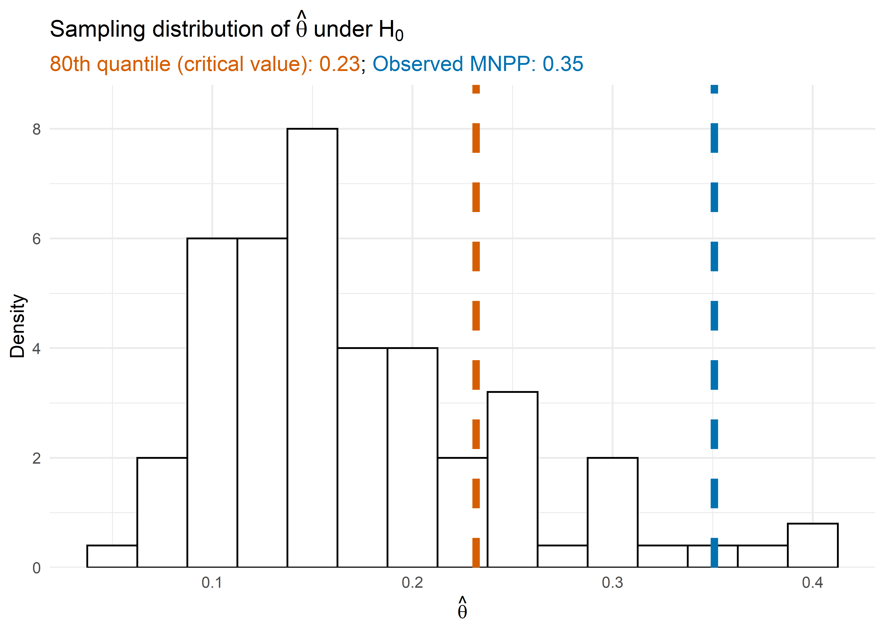

<!-- README.md is generated from README.Rmd. Please edit that file -->

```{r, include = FALSE}
knitr::opts_chunk$set(
  collapse = TRUE,
  comment = "#>",
  fig.path = "man/figures/README-",
  out.width = "100%"
)

library(ggplot2)
library(ggtext)
library(magrittr)
library(kableExtra)
library(Cairo)
library(rpart.plot)
```

# tehtuner

<!-- badges: start -->
[](https://CRAN.R-project.org/package=tehtuner)

[](https://github.com/jackmwolf/tehtuner/actions)
<!-- badges: end -->

The goal of `tehtuner` is to implement methods to fit models to detect and model
treatment effect heterogeneity (TEH) while controlling the Type-I error of falsely 
detecting a differential effect when the conditional average treatment effect is
uniform across the study population.

Currently `tehtuner` supports Virtual Twins models (Foster 
et al., 2011) for detecting TEH.

Virtual Twins is a two-step approach to detecting differential treatment
effects. Subjects' conditional average treatment effects (CATEs) are first
estimated in Step 1 using a flexible model. Then, a simple and interpretable
model is fit in Step 2 to model these estimated CATEs as a function of the
covariates.

The Step 2 model is dependent on some tuning parameter. This parameter is
selected to control the Type-I error rate by permuting the data under the
null hypothesis of a constant treatment effect and identifying the minimal
null penalty parameter (MNPP), which is the smallest penalty parameter that
yields a Step 2 model with no covariate effects. The $1-\alpha$ quantile
of the distribution of is then used to fit the Step 2 model on the original
data.
In dong so, the Type-I error rate is controlled to be $\alpha$.

## Installation

`tehtuner` is available on [CRAN](https://CRAN.R-project.org); you can download the release version with:

``` r
install.packages("tehtuner")
```

You can download the development version from [GitHub](https://github.com/) with:

``` r
# install.packages("devtools")
devtools::install_github("jackmwolf/tehtuner")
```
## Example

We consider simulated data from a small clinical trial with 200 subjects.
Each subject has 10 measured covaraites, 8 continuous and 2 binary.
We are interested in estimating and understanding the CATE through Virtual Twins.

```{r}
library(tehtuner)
data("tehtuner_example")
```

We will consider a Virtual Twins model using a random forest to estimate the CATEs in Step 1 and then fitting a regression tree on the estimated CATEs in Step 2 with the Type-I error rate set at $\alpha = 0.2$.

```{r cache=TRUE}
set.seed(100)
vt_cate <- tunevt(
  data = tehtuner_example, Y = "Y", Trt = "Trt", step1 = "randomforest",
  step2 = "rtree", alpha0 = 0.2, p_reps = 100, ntree = 50
)
```

The fitted Step 2 model can be accessed via `$vtmod`. 
In this case, as we used a regression tree in Step 2, our final model model is of class `rpart`.
```{r dev='CairoPNG', warning = FALSE}
vt_cate$vtmod

rpart.plot::rpart.plot(vt_cate$vtmod)
```

The fitted model for the CATE includes a covariate (`V1`), so we would conclude that there is treatment effect heterogeneity at the 20% level. 
We note that the true data generating mechanism ($Y_i = h(X_i) + T_i g(X_i)$) included an interaction between the treatment and whether $V_1$ was above its true mean (sample mean `r round(mean(tehtuner_example$V1), 2)`) with $g(X_i) = c + 4I(V_{1i}>\mu_1)+4V_{9i}$. 
So, the procedure did not make a Type-I error *and* correctly detected a covariate driving this heterogeneity.

We can also look at the null distribution of the MNPP through `vt_cate$theta_null`.
The 80th quantile of $\hat\theta$ under the null hypothesis is
```{r}
quantile(vt_cate$theta_null, 0.8)
```

while the MNPP of our observed data is
```{r}
vt_cate$mnpp
```

The procedure fit the Step 2 model using the 80th quantile of the null distribution which resulted in a model that included covariates since the MNPP was above the 80th quantile.

```{r mnpp_plot, dev='CairoPNG', echo = FALSE, include = FALSE}
p <- ggplot(mapping = aes(x = vt_cate$theta_null, y = ..density..)) +
  geom_histogram(color = "black", fill = "white", binwidth = 0.025) +
  theme_minimal() +
  scale_y_continuous(expand = expansion(mult = c(0, 0.1))) +
  geom_vline(
    aes(xintercept = c(vt_cate$mnpp, quantile(vt_cate$theta_null, 0.8))),
    color = c("#0072B2", "#D55E00"),
    size = 2,
    linetype = 2
  ) + 
  labs(
    y = "Density",
    x = expression(hat(theta)),
    title =  expression("Sampling distribution of" ~ hat(theta) ~ "under" ~ H[0]),
    subtitle = paste0(
      "<span style='color:#D55E00;'>",
        "80th quantile (critical value): ", formatC(quantile(vt_cate$theta_null, 0.8), digits = 2, format = "f"),
      "</span>",
      "; ",
      "<span style='color:#0072B2;'>",
        "Observed MNPP: ", formatC(vt_cate$mnpp, 2, format = "f"), 
      "</span>"
      )
  ) +
  theme(
    plot.subtitle = element_markdown(size = 12)
  )
ggsave("man/figures/README_mnpp_plot-2.png", plot = p, dpi = 700)
```



### Running in Parallel

Development version `0.1.1.9001` added the `parallel` option to `tunevt()` which allows the user to perform the permutation procedure in parallel to reduce computation times. 
Before doing so, you must register a parallel backend; see `?foreach::foreach` for more information.

For example, to carry out 100 permutations across 2 processors:

```{r eval = FALSE}
cl <- parallel::makeCluster(2)
doParallel::registerDoParallel(cl)

vt_cate_parallel <- tunevt(
  data = tehtuner_example, Y = "Y", Trt = "Trt", step1 = "randomforest",
  step2 = "rtree", alpha0 = 0.2, p_reps = 100, ntree = 50, parallel = TRUE
)

parallel::stopCluster(cl)
```


## References

- Foster, J. C., Taylor, J. M., & Ruberg, S. J. (2011). Subgroup identification from randomized clinical trial data. _Statistics in Medicine, 30_(24), 2867–2880. https://doi.org/10.1002/sim.4322

- Wolf, J. M., Koopmeiners, J. S., & Vock, D. M. (2022). A permutation procedure to detect heterogeneous treatment effects in randomized clinical trials while controlling the type-I error rate. _Clinical Trials 19_(5). https://doi.org/10.1177/17407745221095855
