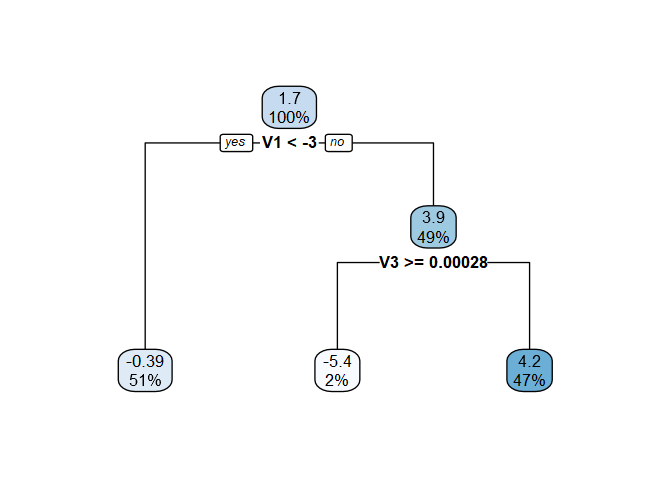

<!-- README.md is generated from README.Rmd. Please edit that file -->

# tunevt

<!-- badges: start -->
<!-- badges: end -->

The goal of tunevt is to implement methods to fit Virtual Twins models
(Foster et al. (2011)) for identifying subgroups with differential
effects in the context of clinical trials while controlling the Type I
error of falsely detecting a differential effect when the conditional
average treatment effect is uniform across the study population.

Virtual Twins is a two-step approach to detecting differential treatment
effects. Subjects’ conditional average treatment effects (CATEs) are
first estimated in Step 1 using a flexible model. Then, a simple and
interpretable model is fit in Step 2 to model these estimated CATEs as a
function of the covariates.

The Step 2 model is dependent on some tuning parameter. This parameter
is selected to control the Type I error rate by permuting the data under
the null hypothesis of a constant treatment effect and identifying the
minimal null penalty parameter (MNPP), which is the smallest penalty
parameter that yields a Step 2 model with no covariate effects. The
1 − *α* quantile of the distribution of is then used to fit the Step 2
model on the original data.

## Installation

`tunevt` is not currently available on
[CRAN](https://CRAN.R-project.org).

You can download the development version from
[GitHub](https://github.com/) with:

    # install.packages("devtools")
    devtools::install_github("jackmwolf/tunevt")

## Example

We consider simulated data from a small clinical trial with 200
subjects. Each subject has 10 measured covaraites, 8 continuous and 2
binary.

    library(tunevt)
    data("tunevt_example")
    head(tunevt_example)
    #>   Trt          Y         V1        V2         V3        V4        V5         V6
    #> 1   0  0.5595756 -1.4112060 -3.874594  0.2231672 1.7721813 -1.428810 -0.1370893
    #> 2   0 -2.6447515 -0.6781110 -3.498075 -1.0145448 1.3024452 -3.615138 -2.5216064
    #> 3   0  3.0444463 -4.3442292 -5.762770 -2.2504632 1.1157850 -3.684517 -1.2147361
    #> 4   0  0.2168473  0.5941628 -3.874255 -0.6807856 0.8121194 -2.894091 -1.4673709
    #> 5   0 -0.9726278 -1.9405842 -2.591424 -0.2939856 0.2310078 -3.186475 -1.9257349
    #> 6   0 -3.6113120 -0.3163217 -2.582381  0.3617208 1.9442535 -2.350791 -3.0099521
    #>          V7       V8 V9 V10
    #> 1 -1.292151 2.150822  1   1
    #> 2 -2.714018 1.773205  1   1
    #> 3 -2.070706 1.647493  1   1
    #> 4 -1.826940 1.702928  1   1
    #> 5 -1.686025 2.181265  0   0
    #> 6 -1.692450 2.854508  0   0

We will consider a Virtual Twins model using a random forest to estimate
the CATEs in Step 1 and then fitting a regression tree on the estimated
CATEs in Step 2 with the Type I error rate set at *α* = 0.2.

    set.seed(100)
    vtmod <- tunevt(
      data = tunevt_example, Y = "Y", Trt = "Trt", step1 = "randomforest",
      step2 = "rtree", alpha0 = 0.2, p_reps = 100, ntree = 50
    )

The fit Step 2 model can be accessed via

    vtmod$vtmod
    #> n= 200 
    #> 
    #> node), split, n, deviance, yval
    #>       * denotes terminal node
    #> 
    #> 1) root 200 4282.543  1.9449220  
    #>   2) V1< -1.081597 125 1418.895 -0.1780733 *
    #>   3) V1>=-1.081597 75 1361.278  5.4832470 *

(*We note that the true data generating mechanism*
(*Y**i* = *h*(*X**i*) + *T**i**g*(*X**i*))
*included an interaction between the treatment and whether*
*V*1 *was above its true mean \[sample mean -1.34\] with*
*g*(*X**i*) = *c* + 4*I*(*V*1*i* &gt; *μ*1) + 4*V*9*i*.
*So, the procedure did not make a Type I error!*)

We can also look at the null distribution of the MNPP (through
`vtmod$theta_null`) and compare `vtmod$mnpp`  = *θ̂*, the MNPP ofour
data, to *θ**α*, the 1 − *α* percentile of the null
distribution. Since *θ̂* &gt; *θ**α* we ended up with a Step 2
model that included at least one covariate.

## References

-   Foster, J. C., Taylor, J. M., & Ruberg, S. J. (2011). Subgroup
    identification from randomized clinical trial data. *Statistics in
    Medicine, 30*(24), 2867–2880.
    <a href="https://doi.org/10.1002/sim.4322" class="uri">https://doi.org/10.1002/sim.4322</a>
