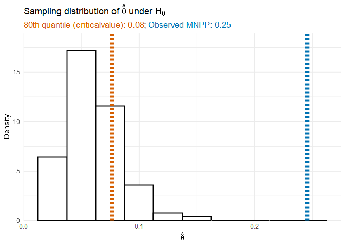

<!-- README.md is generated from README.Rmd. Please edit that file -->

# tehtuner

<!-- badges: start -->

[](https://CRAN.R-project.org/package=tehtuner)

[](https://github.com/jackmwolf/tehtuner/actions)
<!-- badges: end -->

The goal of `tehtuner` is to implement methods to fit models to detect
and model treatment effect heterogeneity (TEH) while controlling the
Type-I error of falsely detecting a differential effect when the
conditional average treatment effect is uniform across the study
population.

Currently `tehtuner` supports Virtual Twins models (Foster et al., 2011)
for detecting TEH using the permutation procedure proposed in (Wolf et
al., 2022).

Virtual Twins is a two-step approach to detecting differential treatment
effects. Subjects’ conditional average treatment effects (CATEs) are
first estimated in Step 1 using a flexible model. Then, a simple and
interpretable model is fit in Step 2 to model these estimated CATEs as a
function of the covariates.

The Step 2 model is dependent on some tuning parameter. This parameter
is selected to control the Type-I error rate by permuting the data under
the null hypothesis of a constant treatment effect and identifying the
minimal null penalty parameter (MNPP), which is the smallest penalty
parameter that yields a Step 2 model with no covariate effects. The
$1-\alpha$ quantile of the distribution of is then used to fit the Step
2 model on the original data. In dong so, the Type-I error rate is
controlled to be $\alpha$.

## Installation

`tehtuner` is available on [CRAN](https://CRAN.R-project.org); you can
download the release version with:

``` r
install.packages("tehtuner")
```

You can download the development version from
[GitHub](https://github.com/) with:

``` r
# install.packages("devtools")
devtools::install_github("jackmwolf/tehtuner")
```

## Example

We consider simulated data from a small clinical trial with 1000
subjects. Each subject has 10 measured covariates, 8 continuous and 2
binary. We are interested in estimating and understanding the CATE
through Virtual Twins.

``` r
library(tehtuner)
data("tehtuner_example")
```

We will consider a Virtual Twins model using a random forest to estimate
the CATEs in Step 1 and then fitting a regression tree on the estimated
CATEs in Step 2 with the Type-I error rate set at $\alpha = 0.2$.

``` r
set.seed(100)
vt_cate <- tunevt(
  data = tehtuner_example, Y = "Y", Trt = "Trt", step1 = "randomforest",
  step2 = "rtree", alpha0 = 0.2, p_reps = 100, ntree = 50
)
vt_cate
#> Call:
#> tunevt(data = tehtuner_example, Y = "Y", Trt = "Trt", step1 = "randomforest", 
#>     step2 = "rtree", alpha0 = 0.2, p_reps = 100, ntree = 50)
#> 
#> Step 2 "rtree" model:
#> n= 1000 
#> 
#> node), split, n, deviance, yval
#>       * denotes terminal node
#> 
#> 1) root 1000 18372.4300  1.6830340  
#>   2) V1< -3.008541 511  5643.7030 -0.3942647 *
#>   3) V1>=-3.008541 489  8219.4140  3.8537890  
#>     6) V3>=0.000282894 19   448.7299 -5.3806930 *
#>     7) V3< 0.000282894 470  6084.9480  4.2270980 *
#> 
#> Approximate 0.8 quantile of the MNPP null distribution: 0.07695
#> Observed MNPP: 0.2454,   p-value: < 2.22e-16
```

The fitted Step 2 model can be accessed via `$vtmod`. In this case, as
we used a regression tree in Step 2, our final model model is of class
`rpart.object`.

``` r
vt_cate$vtmod
#> n= 1000 
#> 
#> node), split, n, deviance, yval
#>       * denotes terminal node
#> 
#> 1) root 1000 18372.4300  1.6830340  
#>   2) V1< -3.008541 511  5643.7030 -0.3942647 *
#>   3) V1>=-3.008541 489  8219.4140  3.8537890  
#>     6) V3>=0.000282894 19   448.7299 -5.3806930 *
#>     7) V3< 0.000282894 470  6084.9480  4.2270980 *

rpart.plot::rpart.plot(vt_cate$vtmod, digits = -2)
```


The fitted model for the CATE is a function of the covariates (`V1`, and
`V3`), so we would conclude that there is treatment effect heterogeneity
at the 20% level.

We can also look at the null distribution of the MNPP through
`vt_cate$theta_null`. The 80th percentile of $\hat\theta$ under the null
hypothesis is

``` r
quantile(vt_cate$theta_null, 0.8)
#>        80% 
#> 0.07673669
```

while the MNPP of our observed data is

``` r
vt_cate$mnpp
#> [1] 0.2454389
```

The procedure fit the Step 2 model using the 80th quantile of the null
distribution which resulted in a model that included covariates since
the MNPP was above the 80th quantile.



### Running in Parallel

Version `0.2.0` added the `parallel` option to `tunevt()` which allows
the user to perform the permutation procedure in parallel to reduce
computation times. Before doing so, you must register a parallel
backend; see `?foreach::foreach` for more information.

For example, to carry out 100 permutations across 2 processors:

``` r
cl <- parallel::makeCluster(2)
doParallel::registerDoParallel(cl)

vt_cate_parallel <- tunevt(
  data = tehtuner_example, Y = "Y", Trt = "Trt", step1 = "randomforest",
  step2 = "rtree", alpha0 = 0.2, p_reps = 100, ntree = 50, parallel = TRUE
)

parallel::stopCluster(cl)
```

## References

- Foster, J. C., Taylor, J. M., & Ruberg, S. J. (2011). Subgroup
  identification from randomized clinical trial data. *Statistics in
  Medicine, 30*(24), 2867–2880. <https://doi.org/10.1002/sim.4322>

- Wolf, J. M., Koopmeiners, J. S., & Vock, D. M. (2022). A permutation
  procedure to detect heterogeneous treatment effects in randomized
  clinical trials while controlling the type-I error rate. *Clinical
  Trials 19*(5). <https://doi.org/10.1177/17407745221095855>

- Deng C., Wolf J. M., Vock D. M., Carroll D. M., Hatsukami D. K., Leng
  N., & Koopmeiners J. S. (2023). “Practical guidance on modeling
  choices for the virtual twins method.” *Journal of Biopharmaceutical
  Statistics*. <https://doi.org/10.1080/10543406.2023.2170404>.
